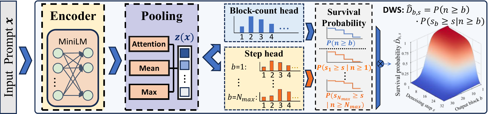

# DWS: Denoising Workload Surface

## Overview

DWS is the research code for **Denoising Surface: Modeling and Predicting Inference Cost for Diffusion LLM Serving**. Built on **SGLang 0.5.10**, it provides inference cost prediction and request scheduling for diffusion large language models (dLLMs).

Block-autoregressive dLLMs generate each output block through multiple denoising steps, whose execution costs vary across positions. DWS represents the probability of executing each cell in a two-dimensional space of output blocks and denoising steps. Combining this workload surface with deployment-specific cost profiles provides a cost estimate for scheduling.

The repository includes:

- **Prompt-only workload prediction:** Predicts block and conditional step survival probabilities and combines them into a DWS before generation begins.
- **Two-stage predictor training:** Stage A learns workload representations through multi-horizon supervision; Stage B learns the detailed DWS probability surface.
- **ONNX export and quantization:** Exports the predictor and quantizes its encoder for lightweight CPU inference.
- **Cost estimation and deployment calibration:** Combines predicted workloads with external cost profiles and supports deployment scale calibration.
- **Cost-based scheduling:** Integrates shortest-job-first (SJF) scheduling into SGLang, with waiting-time aging and non-preemptive decoding.

## Project Structure

The main directories and DWS modules are shown below:

```text
DWS/
├── README.md                         # Project overview
├── LICENSE                           # Apache License 2.0
├── NOTICE                            # Upstream attribution and modifications
├── figs/
│   └── DWS_predictor.png             # Predictor architecture
├── predictor/
│   ├── train.py                      # Two-stage predictor training
│   └── quantize.py                   # ONNX export and encoder quantization
└── python/
    ├── pyproject.toml                # Package metadata and dependencies
    └── sglang/                       # SGLang source with DWS extensions
        ├── launch_server.py          # Inference server entry point
        └── srt/
            ├── server_args.py        # Server and DWS scheduling arguments
            └── dllm/
                ├── config.py         # dLLM and DWS configuration
                ├── algorithm/        # Diffusion decoding and predictor integration
                ├── cost_model.py     # Phase-specific cost estimation
                ├── dws_wsl.py        # DWS cost profile loading and evaluation
                ├── cost_profile_registry.py  # Cost profile management
                ├── mixin/
                │   ├── scheduler.py  # Request admission, SJF, and aging
                │   ├── cost_probe.py # Scheduler-side cost probing and synchronization
                │   └── req.py        # Request execution state and statistics
                └── my_code/
                    ├── predictor_service.py   # Standalone prediction service
                    ├── predictor_client.py    # Prediction service client
                    ├── predictor_backends.py  # Predictor backend adapters
                    ├── dws_marginals.py       # DWS marginal probability processing
                    ├── probe_scale.py         # Deployment scale calibration
                    └── metrics.py             # Runtime metrics
```

Predictor training and export are implemented in [`predictor/`](predictor/). Serving integration, scheduling, and cost estimation are implemented in [`python/sglang/srt/dllm/`](python/sglang/srt/dllm/). Training data, predictor weights, and deployment cost profiles are configured through external paths.

## Deployment

For deployment instructions, see the [official SGLang deployment documentation](https://docs.sglang.io/docs/get-started/install).

## License

This repository includes source code from SGLang 0.5.10 and DWS research extensions. See [LICENSE](LICENSE) and [NOTICE](NOTICE) for licensing and upstream attribution.
